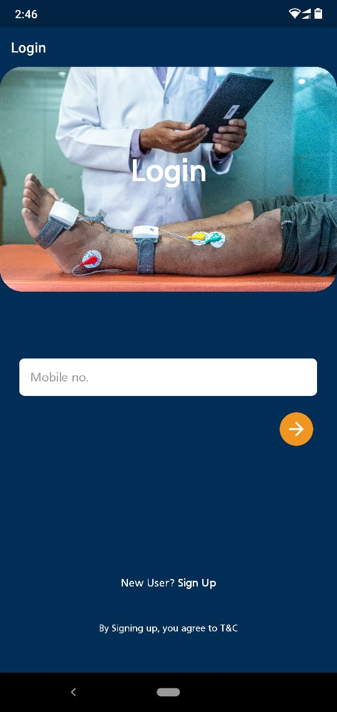
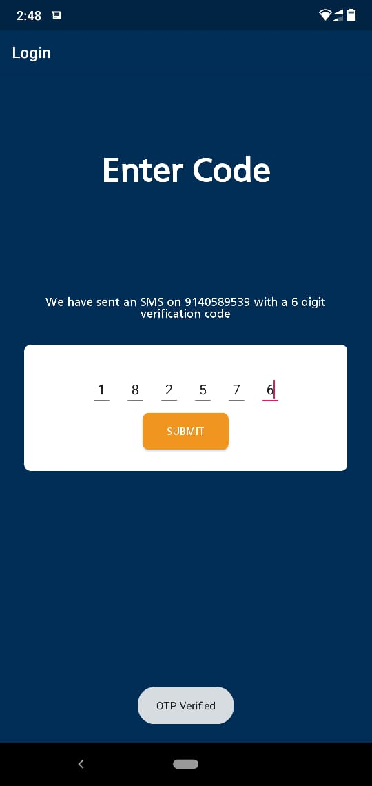

# OTP-login
Authentication through OTP sent on the phone number.

## Approach
- When a user registers successfully, a new entry is created in the MongoDB database .
- Now when a user logs in, credentials are matched from the database.
- If logged in successfully, OTP is sent on the registered phone number.

## Screenshots

          
    
